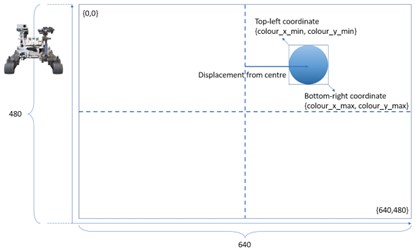
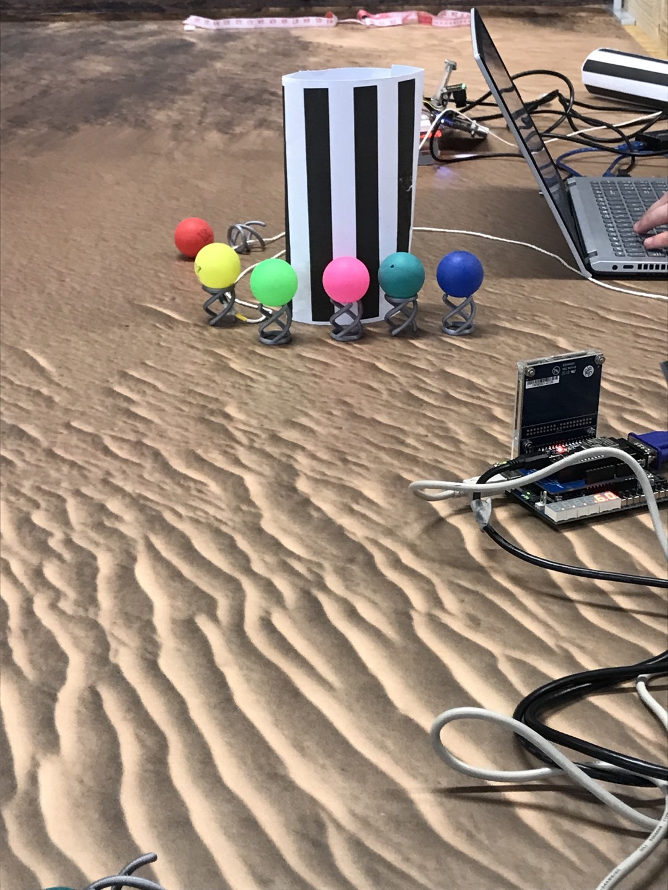
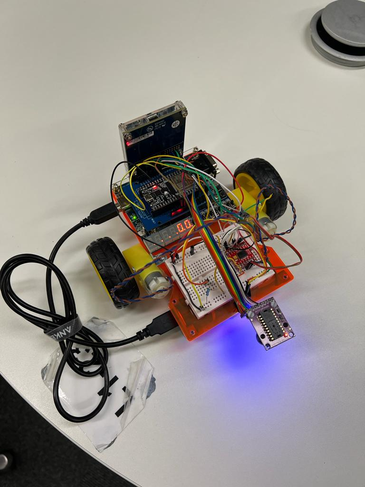

# Mars Rover Project

Command - Hamed

Control - Lian Choi

Drive - Kiril Avramov

Vision - Kihyun Kim

Energy - Hamed Mohammed

Radar - Nazrin Aminuddin

Designed an autonomous rover that can detect and collect the positional
information of specific-coloured objects and build a map of certain area
in the Mars based on the coordinates collected.

# Overview
Mainly worked on the Vision part of the rover which includes object
detection, pixel-space calculation, and data transfer through registers.

Implemented HSV colour conversion algorithm for object detection to
increase the accuracy of the object detection.

Implemented pixel-space ratio multiplication algorithm to calculate the
actual distance between the object and the rover.

Implemented 4-bit registers to store and transfer the data of detected
object. MSB represents the detection, and the rest bits represent colour.

# Images of the terrain and the Rover

